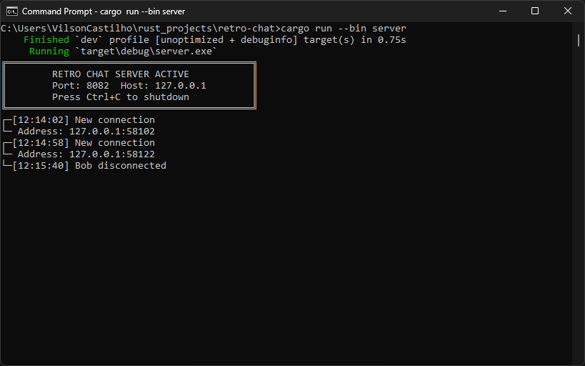
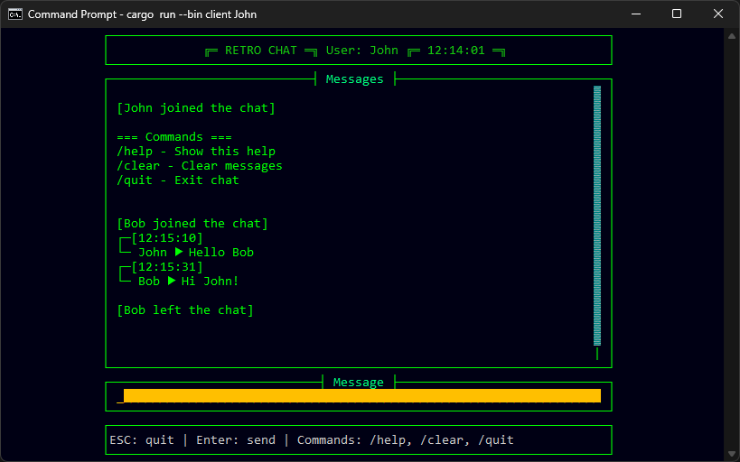

# retro-chat

A retro-style terminal chat application built in Rust. This project uses a TUI (Text User Interface) to bring back that old-school chat vibe while leveraging modern async capabilities. 🖥️🦀

## Features ✨

- 🎨 Retro-style TUI built with `cursive`
- ⚡ Asynchronous server handling with `tokio`
- 👥 Multiple user clients can chat in real-time through a simple TCP server
- 📢 Join/Leave notifications
- 🌈 Colored messages and UI elements
- ⌚ Timestamp for messages

## Screenshots 📷

### Server



### Client



## Prerequisites 📋

To build and run the project, ensure you have the following installed:

- [Rust](https://www.rust-lang.org/) (latest stable version recommended)
- Cargo (Rust's package manager, included with Rust)

## Getting Started 🚀

### 1. Clone the Repository

```bash
$ git clone https://github.com/vilsonfcastilho/retro-chat.git
$ cd retro-chat
```

### 2. Run the Server

Start the chat server:

```bash
$ cargo run --bin server
```

The server listens for incoming connections and relays messages to all connected clients.

### 3. Run the Client

Start a client with your desired username:

```bash
$ cargo run --bin client [username]
```

Example:

```bash
$ cargo run --bin client John
```

You can run multiple terminal instances to simulate different users chatting.

## Controls 🕹️

- Type your message and press Enter to send
- Help command `/help`
- Press Esc to quit
- Messages window automatically scrolls to show new messages
- System notifications for users joining/leaving are highlighted

## Dependencies 📦

This project uses the following Rust crates:

- [`chrono`](https://crates.io/crates/chrono) - Date and time library for Rust.
- [`cursive`](https://crates.io/crates/cursive) - A TUI (Text User Interface) library focused on ease-of-use.
- [`serde`](https://crates.io/crates/serde) - A generic serialization/deserialization framework.
- [`serde_json`](https://crates.io/crates/serde_json) - A JSON serialization file format.
- [`tokio`](https://crates.io/crates/tokio) - An event-driven, non-blocking I/O platform for writing asynchronous I/O backed applications.

Add these dependencies to your `Cargo.toml` file if you're setting up manually:

```toml
[dependencies]
chrono = "0.4.40"
cursive = "0.21.1"
serde = { version = "1.0.218", features = ["derive"] }
serde_json = "1.0.139"
tokio = { version = "1.43.0", features = ["full"] }
```

## Contact 📧

For any inquiries or feedback, feel free to reach out via GitHub or email.

---

Made with ♥ by Vilson Castilho
